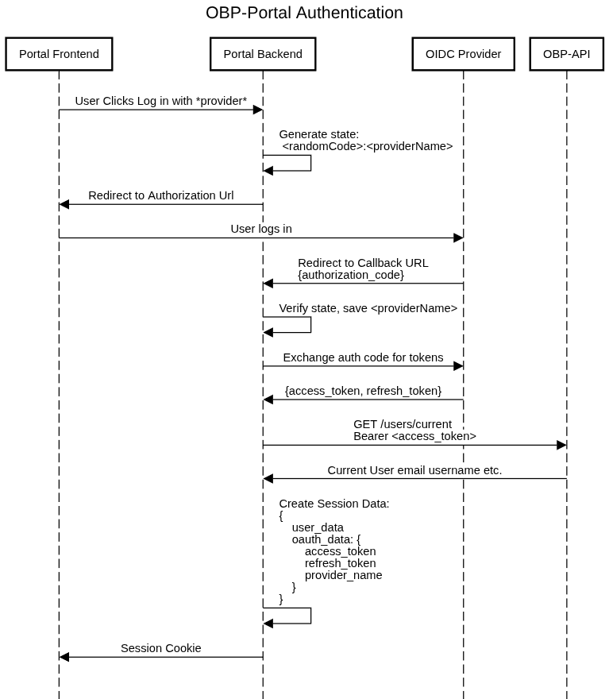

# Authentication

The portal is designed as a Third Party Application (TPA) authenticated over OAuth2 (2.1). The user signs in using an OIDC provider. Currently only Keycloak is active, but theoretically any number of providers can be used (more on this later).

Once signed in, authorized requests are made to OBP API using Bearer authentication.

**At no point should anything be done in the portal using an OBP "Superuser". If the logged in user does not have the entitlement for some action, consider if they should be granted the entitlement or if there is another way to do what you are trying to do.**



## Code Design
Different Provders are set up in the lib/oauth/providerFactory.ts. This provides a scalable way of adding more OAuth2 Providers with different srategies. 

## OIDC Config Discovery

As per OAuth 2.1 spec, OIDC configuration (i.e. authorization url, token exchange url) should all be automatically discovered via the /well-known/oidc-configuration endpoint of the provider. Available providers, along with their /well-known urls are to be found via the OBP API at /obp/v5.1.0/well-known, which provides a list of URLs like:

```json
{
    provider: <provider>
    url: <url>
}
```

>> see the `WellKnownUri` interface in providerFactory.ts and `fetchWellKnownUris` function in hooks.server.ts

This allows for automatic discovery of all available OIDC providers on OBP. They just need implementations in the providerFactory, if not already registered there.